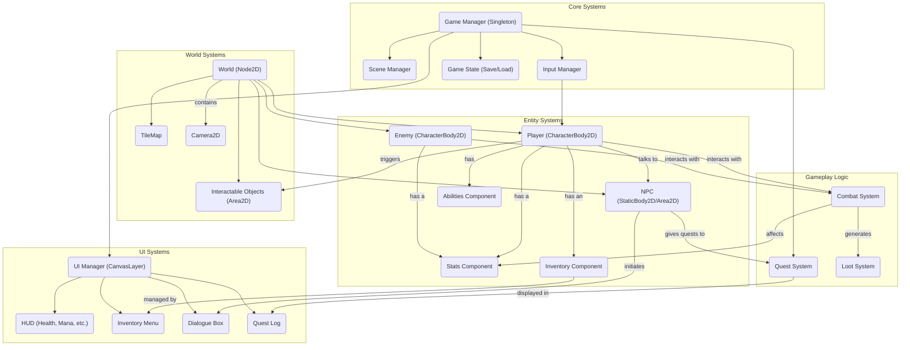

# Game Architecture: Top-Down ARPG

This document outlines the proposed architecture for the top-down ARPG project.

## High-Level Overview

The architecture is designed to be modular and scalable, allowing for systematic feature implementation.

## Architecture Breakdown:

### 1. Core Systems (Singletons/Auto-loads):
*   **Game Manager:** The central hub of the game, responsible for coordinating other managers and handling global game states (e.g., pause, play).
*   **Scene Manager:** Manages loading, unloading, and transitioning between different game scenes (e.g., overworld, dungeons, menus).
*   **Input Manager:** Processes all player inputs. This will remap the existing input actions to be more suitable for a top-down game (e.g., 8-directional movement).
*   **Game State:** Handles saving and loading player progress, including stats, inventory, and quest status.

### 2. Entity Systems (Scene-based):
*   **Player:** The main player character scene. It will contain a state machine for handling different actions (idle, walking, attacking, using items).
*   **Enemies/NPCs:** Base scenes for all non-player characters. They will have their own AI and behavior logic (e.g., pathfinding, attacking, dialogue).
*   **Components:** Reusable nodes that can be attached to entities to provide functionality:
    *   `StatsComponent`: Manages health, mana, attack power, defense, etc.
    *   `InventoryComponent`: Holds items, equipment, and currency.
    *   `AbilitiesComponent`: Manages spells or special skills.

### 3. World Systems:
*   **World Scene:** The main container for a game level or area.
*   **TileMap:** Used to build the level's layout and handle basic collision. We will need to replace the isometric `TileSet` with a top-down one.
*   **Interactable Objects:** Doors, chests, switches, etc., that the player can interact with.

### 4. UI Systems:
*   **UI Manager:** A central node on a `CanvasLayer` to manage all UI elements.
*   **HUD, Menus, etc.:** Separate scenes for each UI component, which are instanced and managed by the UI Manager.

### 5. Gameplay Logic (Scripts/Nodes):
*   **Combat System:** A script or node that handles the logic of combat, including hit detection, damage calculation, and status effects.
*   **Quest System:** Manages quest objectives, progress, and rewards.
*   **Loot System:** Determines item drops from enemies or chests.